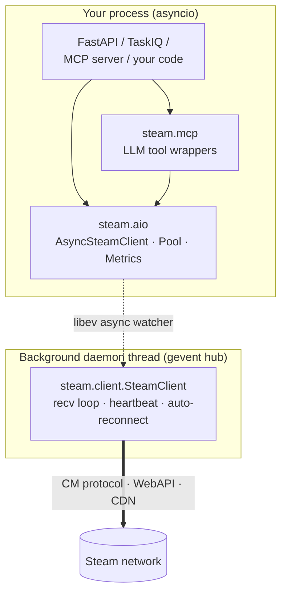

<p align="center">
  
</p>

<p align="center">
  <a href="https://github.com/H47R15/steam/actions/workflows/testing_initiative.yml"></a>
  <a href="https://github.com/H47R15/steam/actions/workflows/codeql.yml"></a>
  <a href="https://api.securityscorecards.dev/projects/github.com/H47R15/steam"></a>
  <a href="https://pypi.org/project/pysteam-client/"></a>
  <a href="https://pypi.org/project/pysteam-client/"></a>
  <a href="https://github.com/H47R15/steam/wiki/MCP"></a>
  <a href="LICENSE"></a>
</p>

# pysteam-client

Modern Python client for the Steam network — CM protocol, PICS, CDN, WebAuth, Web API, Steam Guard, SteamIDs — plus a fully-async facade for FastAPI / TaskIQ and an MCP tool set for LLM agents.

Maintained fork of [ValvePython/steam](https://github.com/ValvePython/steam) for Python 3.13+ and current Steam wire protocols. Full docs in the [Wiki](https://github.com/H47R15/steam/wiki).

## Install

```bash
pip install pysteam-client[client]
```

`[client]` pulls in the gevent-based `SteamClient` (login, PICS, CDN). Without it, the `requests`-only subset (WebAPI / WebAuth / SteamID / master-server query) still works.

## Architecture



## Quick start

**Sync** (script, CLI, batch jobs):

```python
from steam.client import SteamClient

client = SteamClient()
client.anonymous_login()
info = client.get_product_info(apps=[440], timeout=15)
print(info["apps"][440]["common"]["name"])
client.logout()
```

**Async** (FastAPI, TaskIQ, any asyncio app):

```python
from steam.aio import AsyncSteamClient

async with AsyncSteamClient() as client:
    await client.anonymous_login()
    info = await client.get_product_info(apps=[440])
```

**MCP** (expose to an LLM agent):

```python
from mcp.server.fastmcp import FastMCP
from steam.aio import AsyncSteamClient
from steam.mcp import register_steam_tools

server = FastMCP("Steam")
client = AsyncSteamClient()
await client.start()
await client.anonymous_login()
register_steam_tools(server, client)   # steam.status, steam.get_product_info, steam.send_um
```

## Documentation

Full documentation lives in the [**Wiki**](https://github.com/H47R15/steam/wiki):

**Getting started** — [Installation](https://github.com/H47R15/steam/wiki/Installation) · [First script](https://github.com/H47R15/steam/wiki/First-script)

**Client APIs** — [SteamClient](https://github.com/H47R15/steam/wiki/SteamClient) · [PICS](https://github.com/H47R15/steam/wiki/PICS) · [CDNClient](https://github.com/H47R15/steam/wiki/CDNClient) · [WebAuth](https://github.com/H47R15/steam/wiki/WebAuth) · [WebAPI](https://github.com/H47R15/steam/wiki/WebAPI) · [SteamAuthenticator](https://github.com/H47R15/steam/wiki/SteamAuthenticator) · [SteamID](https://github.com/H47R15/steam/wiki/SteamID) · [Master Server Queries](https://github.com/H47R15/steam/wiki/Master-Server-Queries)

**Async / FastAPI / MCP** *(new in 1.6)* — [AsyncSteamClient](https://github.com/H47R15/steam/wiki/AsyncSteamClient) · [Pool](https://github.com/H47R15/steam/wiki/Pool) · [FastAPI Integration](https://github.com/H47R15/steam/wiki/FastAPI-Integration) · [TaskIQ Integration](https://github.com/H47R15/steam/wiki/TaskIQ-Integration) · [MCP](https://github.com/H47R15/steam/wiki/MCP)

**Advanced** — [Regenerating Protobufs](https://github.com/H47R15/steam/wiki/Regenerating-Protobufs) · [Type Checking](https://github.com/H47R15/steam/wiki/Type-Checking) · [Contributing](https://github.com/H47R15/steam/wiki/Contributing) · [Fork Changes](https://github.com/H47R15/steam/wiki/Fork-Changes) · [FAQ](https://github.com/H47R15/steam/wiki/FAQ)

## Security

Every push, PR, and release runs eight independent gates before any wheel ships to PyPI: `ruff` + `black` (style), `mypy --strict` (types on `steam.aio` + `steam.mcp`), `pytest`, `deptry` (deps hygiene), `bandit` (Python SAST), `pip-audit` (CVEs), CodeQL (cross-file SAST), OpenSSF Scorecard (repo posture). A failing gate blocks the publish step.

**Report a vulnerability**: use [GitHub Security Advisories](https://github.com/H47R15/steam/security/advisories/new) (preferred, private, coordinated disclosure). Full policy in [SECURITY.md](SECURITY.md). **Do NOT open a public GitHub issue for security reports.**

## License

MIT — see [LICENSE](LICENSE). Unchanged from upstream.
